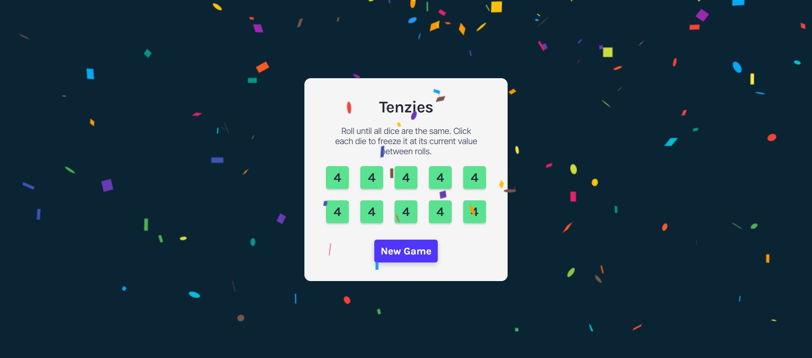

- [Overview](#overview)
  - [Screenshot](#screenshot)
  - [Links](#links)
- [My process](#my-process)
  - [Built with](#built-with)
  - [What I learned](#what-i-learned)
  - [Continued development](#continued-development)

### Overview
This is a pet project from Scrimba React Course. The purpose of this project was to practice useState(), useEffect(), importing React components with npm, mapping through arrays, etc. The project is Tenzies game: a user is rolling dice until all values are the same with the opportunity to click on each die to freeze its current value between rolls.

### Screenshot

### Links

- Live Site URL: [https://magnificent-kitsune-04a8bb.netlify.app/]

## My process

### Built with
- React
  - useState()
  - useEffect()
  - uuidv4 npm
  - react-confetti npm
  - onClick()
- JavaScript
- CSS
- HTML

### What I learned

I have learned how to render React Components and import components from npm, pass props to components, use states and effects, create conditional CSS classes, and add a random id to elements.

### Continued development

The project could be improved by adding a score, or timer for the game, and improving styles for dice to display dice dots instead of number values. 
